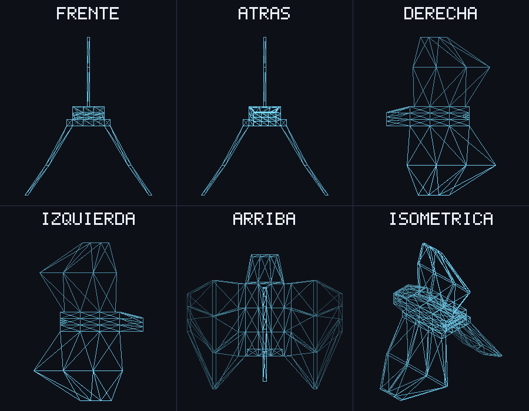

# lab4-graficos

Renderizador por software en Rust que carga un modelo `.obj` y dibuja sus triángulos en wireframe sobre un framebuffer propio. Raylib solo se usa para abrir la ventana y mostrar el framebuffer como textura; todo el dibujo (líneas y triángulos) se hace en CPU.



*Modelo de la nave: 172 vértices, 364 triángulos.*

## Características

- **Cargador OBJ** (`src/obj.rs`): lee vértices (`v`) y caras (`f`), acepta el formato `v/vt/vn` y triangula polígonos (por ejemplo, quads) en abanico.
- **Framebuffer propio** (`src/framebuffer.rs`): arreglo de píxeles RGBA con `clear`, `put_pixel`, líneas con el algoritmo de **Bresenham** y contorno de triángulos.
- **Render** (`src/main.rs`): centra y escala el modelo según su caja envolvente en x,y para que ocupe ~88 % de la ventana (900×700). Usa proyección ortográfica simple: se descarta la coordenada z.
- **Modo captura**: exporta el framebuffer a `screenshot.png` sin abrir ventana.

## Cómo funciona

1. `Model::load` lee el `.obj` y guarda los vértices y una lista de índices, de 3 en 3 (un triángulo por grupo). Las líneas `vt`, `vn`, `mtllib`, etc. se ignoran.
2. `Model::bounds_xy` calcula la caja envolvente del modelo en x,y.
3. `render` limpia el framebuffer con el color de fondo, convierte cada vértice a coordenadas de pantalla (centrado, escalado e invirtiendo y, porque en pantalla crece hacia abajo) y dibuja el contorno de cada triángulo con `Framebuffer::triangle`.
4. El framebuffer se sube una sola vez a una textura de raylib y se muestra a 60 FPS, o se exporta a PNG en modo captura.

Colores: fondo `rgb(14, 16, 24)` y líneas `rgb(120, 220, 255)`.

## Requisitos

- [Rust](https://www.rust-lang.org/tools/install) (edición 2021)
- Dependencias de compilación de `raylib-rs`: CMake y un compilador de C. En Linux/WSL también hacen falta las librerías de desarrollo de X11/OpenGL, por ejemplo:

  ```bash
  sudo apt install cmake clang libx11-dev libxrandr-dev libxinerama-dev libxcursor-dev libxi-dev libgl1-mesa-dev
  ```

## Uso

```bash
# Abre la ventana con el modelo por defecto (assets/Nave_Javier_Alvarado.obj)
cargo run --release

# Carga otro archivo OBJ
cargo run --release -- ruta/al/modelo.obj

# Genera screenshot.png sin abrir ventana
cargo run --release -- --screenshot
```

Al iniciar, el programa imprime cuántos vértices y triángulos cargó. Si el archivo no se puede leer o no contiene vértices, muestra el error y termina con código 1.

Los argumentos que empiezan con `--` se tratan como opciones; el primero que no lo hace se toma como ruta del modelo.

## Estructura

```
.
├── assets/
│   └── Nave_Javier_Alvarado.obj   # Modelo de la nave (exportado desde Blender)
├── src/
│   ├── main.rs         # Transformación a pantalla, render y ventana
│   ├── obj.rs          # Cargador de archivos OBJ
│   └── framebuffer.rs  # Framebuffer y primitivas de dibujo
├── screenshot.png      # Captura generada con --screenshot
└── Cargo.toml
```

## Autor

Javier Alvarado
