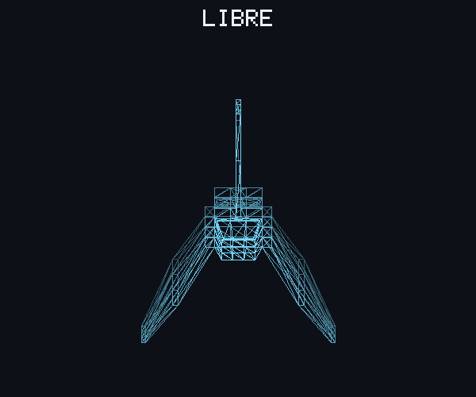

# lab4-graficos

Renderizador por software en Rust que carga un modelo `.obj` y dibuja sus triángulos en wireframe sobre un framebuffer propio, desde varias vistas (frente, atrás, lados, arriba, abajo, isométrica y rotación libre). Raylib solo se usa para abrir la ventana y mostrar el framebuffer como textura; todo el dibujo (líneas y triángulos) se hace en CPU.


*Modelo de la nave: 172 vértices, 364 triángulos.*



*Modo libre: una vuelta completa alrededor de la nave.*

## Características

- **Vistas** (`src/main.rs`): cada vista es un giro en y (yaw) y una inclinación en x (pitch) que se aplican a los vértices antes de proyectar. Por defecto se muestran seis vistas en una cuadrícula de 3×2.
- **Sombreado por profundidad**: los triángulos se dibujan de atrás hacia adelante y los más lejanos salen más oscuros, para distinguir qué está adelante.
- **Cargador OBJ** (`src/obj.rs`): lee vértices (`v`) y caras (`f`), acepta el formato `v/vt/vn` y triangula polígonos (por ejemplo, quads) en abanico.
- **Framebuffer propio** (`src/framebuffer.rs`): arreglo de píxeles RGBA con `clear`, `put_pixel`, líneas con el algoritmo de **Bresenham**, contorno de triángulos y texto con una fuente de píxeles de 5×7.
- **Títulos**: cada vista lleva su nombre centrado arriba (FRENTE, ATRAS, …), dibujado en el framebuffer, así que también sale en la captura PNG.
- **Render** (`src/main.rs`): centra y escala el modelo para que ocupe ~88 % de su área (la ventana de 900×700 o una celda de la cuadrícula). Usa proyección ortográfica: después de rotar se descarta la coordenada z.
- **Modo captura**: exporta la cuadrícula de vistas a `screenshot.png` sin abrir ventana.
- **Modo GIF**: exporta una vuelta completa del modo libre a `rotacion.gif` (600×500, 90 cuadros a 25 FPS, en bucle) sin abrir ventana. Usa el crate [`gif`](https://crates.io/crates/gif).

## Cómo funciona

1. `Model::load` lee el `.obj` y guarda los vértices y una lista de índices, de 3 en 3 (un triángulo por grupo). Las líneas `vt`, `vn`, `mtllib`, etc. se ignoran.
2. `render_view` centra el modelo en su caja envolvente 3D y rota cada vértice según la vista (`rotate`).
3. Con la caja envolvente en x,y de la vista rotada calcula la escala para que el modelo quepa en su área, y convierte cada vértice a coordenadas de pantalla (invirtiendo y, porque en pantalla crece hacia abajo). En la vista libre la escala sale de la esfera envolvente, así el tamaño no cambia mientras rota.
4. Ordena los triángulos por su profundidad media, de lejos a cerca, y dibuja el contorno de cada uno con `Framebuffer::triangle`, en un tono más oscuro cuanto más lejos está.
5. El framebuffer se vuelve a dibujar y se sube a una textura de raylib en cada cuadro (60 FPS), o se exporta a PNG en modo captura.

La fuente solo tiene las letras que usan los títulos y no lleva tildes ("Atrás" se escribe ATRAS).

Colores: fondo `rgb(14, 16, 24)` y líneas `rgb(120, 220, 255)`.

La nave apunta hacia +z: "Frente" mira desde +z, "Atrás" desde −z, "Derecha" desde −x, "Izquierda" desde +x y "Arriba" desde +y. Si el modelo se exportó con otros ejes, basta con ajustar los ángulos del arreglo `VIEWS` en `src/main.rs`.

## Requisitos

- [Rust](https://www.rust-lang.org/tools/install) (edición 2021)
- Dependencias de compilación de `raylib-rs`: CMake y un compilador de C. En Linux/WSL también hacen falta las librerías de desarrollo de X11/OpenGL, por ejemplo:

  ```bash
  sudo apt install cmake clang libx11-dev libxrandr-dev libxinerama-dev libxcursor-dev libxi-dev libgl1-mesa-dev
  ```

## Uso

```bash
# Abre la ventana con el modelo por defecto (assets/Nave_Javier_Alvarado.obj) en la cuadrícula de vistas
cargo run --release

# Carga otro archivo OBJ
cargo run --release -- ruta/al/modelo.obj

# Genera screenshot.png sin abrir ventana
cargo run --release -- --screenshot

# Genera rotacion.gif (modo libre) sin abrir ventana
cargo run --release -- --gif
```

### Controles

| Tecla | Acción |
|---|---|
| `0` o `Tab` | Cuadrícula con seis vistas (por defecto) |
| `1` – `7` | Una sola vista: Frente, Atrás, Izquierda, Derecha, Arriba, Abajo, Isométrica |
| Flechas | Rotar libremente (desde la cuadrícula arranca en la isométrica) |

Al iniciar, el programa imprime cuántos vértices y triángulos cargó. Si el archivo no se puede leer o no contiene vértices, muestra el error y termina con código 1.

Los argumentos que empiezan con `--` se tratan como opciones; el primero que no lo hace se toma como ruta del modelo.

## Estructura

```
.
├── assets/
│   └── Nave_Javier_Alvarado.obj   # Modelo de la nave (exportado desde Blender)
├── src/
│   ├── main.rs         # Vistas, rotación, render, ventana y controles
│   ├── obj.rs          # Cargador de archivos OBJ
│   └── framebuffer.rs  # Framebuffer y primitivas de dibujo
├── screenshot.png      # Captura de las seis vistas, generada con --screenshot
├── rotacion.gif        # Rotación del modo libre, generada con --gif
└── Cargo.toml
```

## Autor

Javier Alvarado - 24546
